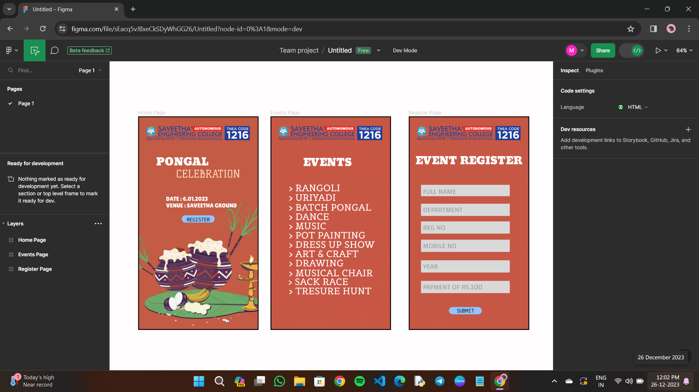

# Ex09 Event Registration Web Application
## Date:26.12.2023
## AIM:
To design, develop and deploy a web application for event registration.

## DESIGN STEPS:

### Step 1:
Create a new frame.

### Step 2:
Select any one preset size of your choice.

### Step 3:
Select the shapes you need.

### Step 4:
Import images as needed.

### Step 5:
Create pages based on your need and link them.

### Step 6:

Validate the HTML and CSS code.

### Step 6:

Publish the website in the given URL.

## DESIGN TOOL:
Figma

## CODE
```
Home Page

<div class="RegisterPage" style="width: 100%; height: 100%; position: relative; background: white; border: 3px black solid">
    
    <div class="Frame1" style="width: 305px; height: 98px; left: 42px; top: 312px; position: absolute">
        <div class="Rectangle2" style="width: 326px; height: 42px; left: 0px; top: 50px; position: absolute; background: #D9D9D9"></div>
        <div class="RegNo" style="width: 292px; height: 33px; left: 7px; top: 50px; position: absolute; color: rgba(8.27, 7.99, 7.99, 0.28); font-size: 24px; font-family: Changa; font-weight: 400; word-wrap: break-word">REG NO</div>
    </div>
    <div class="Frame3" style="width: 305px; height: 98px; left: 42px; top: 375px; position: absolute">
        <div class="Rectangle2" style="width: 326px; height: 42px; left: 0px; top: 50px; position: absolute; background: #D9D9D9"></div>
        <div class="MobileNo" style="width: 292px; height: 33px; left: 7px; top: 50px; position: absolute; color: rgba(8.27, 7.99, 7.99, 0.28); font-size: 24px; font-family: Changa; font-weight: 400; word-wrap: break-word">MOBILE NO</div>
    </div>
    <div class="Frame6" style="width: 305px; height: 98px; left: 42px; top: 446px; position: absolute">
        <div class="Rectangle2" style="width: 326px; height: 42px; left: 0px; top: 50px; position: absolute; background: #D9D9D9"></div>
        <div class="Year" style="width: 292px; height: 33px; left: 7px; top: 50px; position: absolute; color: rgba(8.27, 7.99, 7.99, 0.28); font-size: 24px; font-family: Changa; font-weight: 400; word-wrap: break-word">YEAR</div>
    </div>
    <div class="Frame5" style="width: 305px; height: 98px; left: 42px; top: 517px; position: absolute">
        <div class="Rectangle2" style="width: 326px; height: 42px; left: 0px; top: 50px; position: absolute; background: #D9D9D9"></div>
        <div class="PaymentOfRs100" style="width: 292px; height: 33px; left: 7px; top: 50px; position: absolute; color: rgba(8.27, 7.99, 7.99, 0.28); font-size: 24px; font-family: Changa; font-weight: 400; word-wrap: break-word">PAYMENT OF RS.100</div>
    </div>
    <div class="Frame7" style="width: 305px; height: 98px; left: 42px; top: 517px; position: absolute">
        <div class="Rectangle2" style="width: 326px; height: 42px; left: 0px; top: 50px; position: absolute; background: #D9D9D9"></div>
        <div class="PaymentOfRs100" style="width: 292px; height: 33px; left: 7px; top: 50px; position: absolute; color: rgba(8.27, 7.99, 7.99, 0.28); font-size: 24px; font-family: Changa; font-weight: 400; word-wrap: break-word">PAYMENT OF RS.100</div>
    </div>
    <div class="Frame4" style="width: 305px; height: 98px; left: 42px; top: 251px; position: absolute">
        <div class="Rectangle2" style="width: 326px; height: 42px; left: 0px; top: 50px; position: absolute; background: #D9D9D9"></div>
        <div class="Department" style="width: 292px; height: 33px; left: 7px; top: 50px; position: absolute; color: rgba(8.27, 7.99, 7.99, 0.28); font-size: 24px; font-family: Changa; font-weight: 400; word-wrap: break-word">DEPARTMENT</div>
    </div>
    <div class="Frame2" style="width: 305px; height: 89px; left: 42px; top: 186px; position: absolute">
        <div class="Rectangle2" style="width: 326px; height: 42px; left: 0px; top: 50px; position: absolute; background: #D9D9D9"></div>
        <div class="FullName" style="width: 292px; height: 33px; left: 7px; top: 52px; position: absolute; color: rgba(8.27, 7.99, 7.99, 0.28); font-size: 24px; font-family: Changa; font-weight: 400; word-wrap: break-word">FULL NAME</div>
    </div>
    <div class="EventRegister" style="left: 23px; top: 121px; position: absolute; color: white; font-size: 36px; font-family: Angkor; font-weight: 400; word-wrap: break-word">EVENT REGISTER</div>
    <div class="Rectangle1" style="width: 113px; height: 25px; left: 138px; top: 657px; position: absolute; background: #93C4FD; border-radius: 15px"></div>
    <div class="Submit" style="left: 165px; top: 659px; position: absolute; text-align: center; color: black; font-size: 20px; font-family: Ligconsolata; font-weight: 400; word-wrap: break-word">SUBMIT</div>
    
</div>

// REG NO
color: rgba(8.27, 7.99, 7.99, 0.28);
 font-size: 24px;
 font-family: Changa;
 font-weight: 400;
 word-wrap: break-word
---
// MOBILE NO
color: rgba(8.27, 7.99, 7.99, 0.28);
 font-size: 24px;
 font-family: Changa;
 font-weight: 400;
 word-wrap: break-word
---
// YEAR
color: rgba(8.27, 7.99, 7.99, 0.28);
 font-size: 24px;
 font-family: Changa;
 font-weight: 400;
 word-wrap: break-word
---
// PAYMENT OF RS.100
color: rgba(8.27, 7.99, 7.99, 0.28);
 font-size: 24px;
 font-family: Changa;
 font-weight: 400;
 word-wrap: break-word
---
// PAYMENT OF RS.100
color: rgba(8.27, 7.99, 7.99, 0.28);
 font-size: 24px;
 font-family: Changa;
 font-weight: 400;
 word-wrap: break-word
---
// DEPARTMENT
color: rgba(8.27, 7.99, 7.99, 0.28);
 font-size: 24px;
 font-family: Changa;
 font-weight: 400;
 word-wrap: break-word
---
// FULL NAME
color: rgba(8.27, 7.99, 7.99, 0.28);
 font-size: 24px;
 font-family: Changa;
 font-weight: 400;
 word-wrap: break-word
---
// EVENT REGISTER
color: white;
 font-size: 36px;
 font-family: Angkor;
 font-weight: 400;
 word-wrap: break-word
---
// SUBMIT
color: black;
 font-size: 20px;
 font-family: Ligconsolata;
 font-weight: 400;
 word-wrap: break-word

 Events Page

 <div class="EventsPage" style="width: 100%; height: 100%; position: relative; background: white; border: 3px black solid">
    
    <div class="Events" style="left: 112px; top: 127px; position: absolute; color: white; font-size: 36px; font-family: Angkor; font-weight: 400; word-wrap: break-word">EVENTS</div>
    <div class="Rangoli" style="width: 292px; height: 33px; left: 63px; top: 226px; position: absolute; color: white; font-size: 32px; font-family: Belgrano; font-weight: 400; word-wrap: break-word">> RANGOLI</div>
    <div class="Music" style="width: 292px; height: 33px; left: 63px; top: 357px; position: absolute; color: white; font-size: 32px; font-family: Belgrano; font-weight: 400; word-wrap: break-word">> MUSIC</div>
    <div class="Dance" style="width: 292px; height: 33px; left: 63px; top: 325px; position: absolute; color: white; font-size: 32px; font-family: Belgrano; font-weight: 400; word-wrap: break-word">> DANCE</div>
    <div class="BatchPongal" style="width: 292px; height: 33px; left: 63px; top: 293px; position: absolute; color: white; font-size: 32px; font-family: Belgrano; font-weight: 400; word-wrap: break-word">> BATCH PONGAL</div>
    <div class="Uriyadi" style="width: 292px; height: 33px; left: 63px; top: 259px; position: absolute; color: white; font-size: 32px; font-family: Belgrano; font-weight: 400; word-wrap: break-word">> URIYADI</div>
    <div class="Drawing" style="width: 292px; height: 33px; left: 63px; top: 485px; position: absolute; color: white; font-size: 32px; font-family: Belgrano; font-weight: 400; word-wrap: break-word">> DRAWING</div>
    <div class="ArtCraft" style="width: 292px; height: 33px; left: 63px; top: 453px; position: absolute; color: white; font-size: 32px; font-family: Belgrano; font-weight: 400; word-wrap: break-word">> ART & CRAFT</div>
    <div class="DressUpShow" style="width: 324px; height: 33px; left: 63px; top: 421px; position: absolute; color: white; font-size: 32px; font-family: Belgrano; font-weight: 400; word-wrap: break-word">> DRESS UP SHOW</div>
    <div class="PotPainting" style="width: 292px; height: 33px; left: 63px; top: 389px; position: absolute; color: white; font-size: 32px; font-family: Belgrano; font-weight: 400; word-wrap: break-word">> POT PAINTING</div>
    <div class="TresureHunt" style="width: 292px; height: 33px; left: 63px; top: 581px; position: absolute; color: white; font-size: 32px; font-family: Belgrano; font-weight: 400; word-wrap: break-word">> TRESURE HUNT</div>
    <div class="SackRace" style="width: 292px; height: 33px; left: 61px; top: 549px; position: absolute; color: white; font-size: 32px; font-family: Belgrano; font-weight: 400; word-wrap: break-word">> SACK RACE</div>
    <div class="MusicalChair" style="width: 292px; height: 33px; left: 63px; top: 519px; position: absolute; color: white; font-size: 32px; font-family: Belgrano; font-weight: 400; word-wrap: break-word">> MUSICAL CHAIR</div>
    
</div>

// EVENTS
color: white;
 font-size: 36px;
 font-family: Angkor;
 font-weight: 400;
 word-wrap: break-word
---
// > RANGOLI
color: white;
 font-size: 32px;
 font-family: Belgrano;
 font-weight: 400;
 word-wrap: break-word
---
// > MUSIC
color: white;
 font-size: 32px;
 font-family: Belgrano;
 font-weight: 400;
 word-wrap: break-word
---
// > DANCE
color: white;
 font-size: 32px;
 font-family: Belgrano;
 font-weight: 400;
 word-wrap: break-word
---
// > BATCH PONGAL
color: white;
 font-size: 32px;
 font-family: Belgrano;
 font-weight: 400;
 word-wrap: break-word
---
// > URIYADI
color: white;
 font-size: 32px;
 font-family: Belgrano;
 font-weight: 400;
 word-wrap: break-word
---
// > DRAWING
color: white;
 font-size: 32px;
 font-family: Belgrano;
 font-weight: 400;
 word-wrap: break-word
---
// > ART & CRAFT
color: white;
 font-size: 32px;
 font-family: Belgrano;
 font-weight: 400;
 word-wrap: break-word
---
// > DRESS UP SHOW
color: white;
 font-size: 32px;
 font-family: Belgrano;
 font-weight: 400;
 word-wrap: break-word
---
// > POT PAINTING
color: white;
 font-size: 32px;
 font-family: Belgrano;
 font-weight: 400;
 word-wrap: break-word
---
// > TRESURE HUNT
color: white;
 font-size: 32px;
 font-family: Belgrano;
 font-weight: 400;
 word-wrap: break-word
---
// > SACK RACE
color: white;
 font-size: 32px;
 font-family: Belgrano;
 font-weight: 400;
 word-wrap: break-word
---
// > MUSICAL CHAIR
color: white;
 font-size: 32px;
 font-family: Belgrano;
 font-weight: 400;
 word-wrap: break-word

Register Page

<div class="RegisterPage" style="width: 100%; height: 100%; position: relative; background: white; border: 3px black solid">
    
    <div class="Frame1" style="width: 305px; height: 98px; left: 42px; top: 312px; position: absolute">
        <div class="Rectangle2" style="width: 326px; height: 42px; left: 0px; top: 50px; position: absolute; background: #D9D9D9"></div>
        <div class="RegNo" style="width: 292px; height: 33px; left: 7px; top: 50px; position: absolute; color: rgba(8.27, 7.99, 7.99, 0.28); font-size: 24px; font-family: Changa; font-weight: 400; word-wrap: break-word">REG NO</div>
    </div>
    <div class="Frame3" style="width: 305px; height: 98px; left: 42px; top: 375px; position: absolute">
        <div class="Rectangle2" style="width: 326px; height: 42px; left: 0px; top: 50px; position: absolute; background: #D9D9D9"></div>
        <div class="MobileNo" style="width: 292px; height: 33px; left: 7px; top: 50px; position: absolute; color: rgba(8.27, 7.99, 7.99, 0.28); font-size: 24px; font-family: Changa; font-weight: 400; word-wrap: break-word">MOBILE NO</div>
    </div>
    <div class="Frame6" style="width: 305px; height: 98px; left: 42px; top: 446px; position: absolute">
        <div class="Rectangle2" style="width: 326px; height: 42px; left: 0px; top: 50px; position: absolute; background: #D9D9D9"></div>
        <div class="Year" style="width: 292px; height: 33px; left: 7px; top: 50px; position: absolute; color: rgba(8.27, 7.99, 7.99, 0.28); font-size: 24px; font-family: Changa; font-weight: 400; word-wrap: break-word">YEAR</div>
    </div>
    <div class="Frame5" style="width: 305px; height: 98px; left: 42px; top: 517px; position: absolute">
        <div class="Rectangle2" style="width: 326px; height: 42px; left: 0px; top: 50px; position: absolute; background: #D9D9D9"></div>
        <div class="PaymentOfRs100" style="width: 292px; height: 33px; left: 7px; top: 50px; position: absolute; color: rgba(8.27, 7.99, 7.99, 0.28); font-size: 24px; font-family: Changa; font-weight: 400; word-wrap: break-word">PAYMENT OF RS.100</div>
    </div>
    <div class="Frame7" style="width: 305px; height: 98px; left: 42px; top: 517px; position: absolute">
        <div class="Rectangle2" style="width: 326px; height: 42px; left: 0px; top: 50px; position: absolute; background: #D9D9D9"></div>
        <div class="PaymentOfRs100" style="width: 292px; height: 33px; left: 7px; top: 50px; position: absolute; color: rgba(8.27, 7.99, 7.99, 0.28); font-size: 24px; font-family: Changa; font-weight: 400; word-wrap: break-word">PAYMENT OF RS.100</div>
    </div>
    <div class="Frame4" style="width: 305px; height: 98px; left: 42px; top: 251px; position: absolute">
        <div class="Rectangle2" style="width: 326px; height: 42px; left: 0px; top: 50px; position: absolute; background: #D9D9D9"></div>
        <div class="Department" style="width: 292px; height: 33px; left: 7px; top: 50px; position: absolute; color: rgba(8.27, 7.99, 7.99, 0.28); font-size: 24px; font-family: Changa; font-weight: 400; word-wrap: break-word">DEPARTMENT</div>
    </div>
    <div class="Frame2" style="width: 305px; height: 89px; left: 42px; top: 186px; position: absolute">
        <div class="Rectangle2" style="width: 326px; height: 42px; left: 0px; top: 50px; position: absolute; background: #D9D9D9"></div>
        <div class="FullName" style="width: 292px; height: 33px; left: 7px; top: 52px; position: absolute; color: rgba(8.27, 7.99, 7.99, 0.28); font-size: 24px; font-family: Changa; font-weight: 400; word-wrap: break-word">FULL NAME</div>
    </div>
    <div class="EventRegister" style="left: 23px; top: 121px; position: absolute; color: white; font-size: 36px; font-family: Angkor; font-weight: 400; word-wrap: break-word">EVENT REGISTER</div>
    <div class="Rectangle1" style="width: 113px; height: 25px; left: 138px; top: 657px; position: absolute; background: #93C4FD; border-radius: 15px"></div>
    <div class="Submit" style="left: 165px; top: 659px; position: absolute; text-align: center; color: black; font-size: 20px; font-family: Ligconsolata; font-weight: 400; word-wrap: break-word">SUBMIT</div>
    
</div>

// REG NO
color: rgba(8.27, 7.99, 7.99, 0.28);
 font-size: 24px;
 font-family: Changa;
 font-weight: 400;
 word-wrap: break-word
---
// MOBILE NO
color: rgba(8.27, 7.99, 7.99, 0.28);
 font-size: 24px;
 font-family: Changa;
 font-weight: 400;
 word-wrap: break-word
---
// YEAR
color: rgba(8.27, 7.99, 7.99, 0.28);
 font-size: 24px;
 font-family: Changa;
 font-weight: 400;
 word-wrap: break-word
---
// PAYMENT OF RS.100
color: rgba(8.27, 7.99, 7.99, 0.28);
 font-size: 24px;
 font-family: Changa;
 font-weight: 400;
 word-wrap: break-word
---
// PAYMENT OF RS.100
color: rgba(8.27, 7.99, 7.99, 0.28);
 font-size: 24px;
 font-family: Changa;
 font-weight: 400;
 word-wrap: break-word
---
// DEPARTMENT
color: rgba(8.27, 7.99, 7.99, 0.28);
 font-size: 24px;
 font-family: Changa;
 font-weight: 400;
 word-wrap: break-word
---
// FULL NAME
color: rgba(8.27, 7.99, 7.99, 0.28);
 font-size: 24px;
 font-family: Changa;
 font-weight: 400;
 word-wrap: break-word
---
// EVENT REGISTER
color: white;
 font-size: 36px;
 font-family: Angkor;
 font-weight: 400;
 word-wrap: break-word
---
// SUBMIT
color: black;
 font-size: 20px;
 font-family: Ligconsolata;
 font-weight: 400;
 word-wrap: break-word

```
## OUTPUT:



## RESULT:
The program to design, develop and deploy a web application for event registration is completed successfully.
